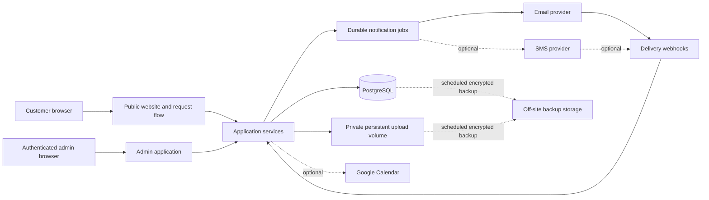
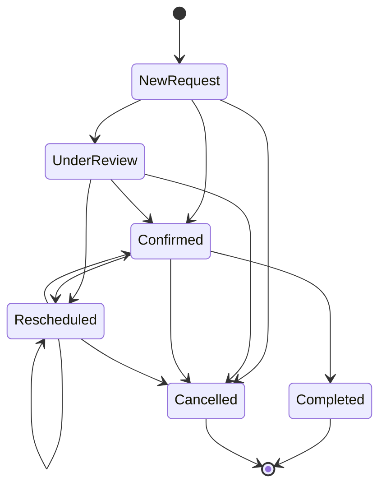

# Geeks Near Me - Phase 1 Architecture

## Architecture decision

Build Phase 1 as a single TypeScript web application with clear internal boundaries, not as microservices. A modular monolith keeps delivery, security, and operations simple while preserving seams for later integrations.

Recommended baseline, subject to account/budget approval:

- Web application: Next.js App Router + TypeScript
- UI: CSS Modules, global CSS layers, project-owned custom-property design tokens, and accessible primitives
- Motion: Motion for UI animation; React Three Fiber/Three.js for one art-directed 3D scene
- Database: PostgreSQL on the Phase 1 VPS with a persistent volume and off-site backups
- Validation: one shared schema layer used at form, API, and persistence boundaries
- Admin authentication: database-backed admin sessions with server-side checks; MFA-ready
- Uploads: private persistent VPS volume behind authorized download routes; adapter-ready for later object storage
- Email: transactional email provider with webhook/delivery logging
- SMS and Google Calendar: adapters kept disabled until approved
- Hosting: one Hostinger VPS running Ubuntu LTS and Docker Compose, with Caddy as the HTTPS reverse proxy

The Phase 1 deployment is intentionally a single-server modular monolith. Exact email, SMS, calendar, bot-protection, and monitoring providers remain unlocked until their accounts and budgets are approved. Runtime and package versions are pinned to supported stable/LTS releases during initialization.

## System context



## Architectural principles

1. **Server-authoritative:** authentication, validation, status transitions, file authorization, and notification decisions run on the server.
2. **One business action, one transaction:** request creation and admin actions are idempotent and auditable.
3. **Adapters around vendors:** email, SMS, calendar, storage, and bot protection sit behind narrow interfaces.
4. **Progressive enhancement:** core content and the form work without the 3D scene. WebGL is decoration, never a dependency.
5. **Private by default:** customer data and files are never public assets.
6. **Scope control:** Phase 1 domain concepts remain appointments, notes, attachments, admin users, events, and notifications.

## Proposed repository structure

```text
geeks-near-me/
|-- app/
|   |-- (public)/
|   |   |-- page.tsx
|   |   |-- request-appointment/
|   |   |-- privacy/
|   |   `-- terms/
|   |-- admin/
|   |   |-- appointments/
|   |   `-- layout.tsx
|   |-- api/
|   |   |-- appointments/
|   |   |-- uploads/
|   |   `-- webhooks/
|   |-- layout.tsx
|   `-- globals.css
|-- components/
|   |-- admin/
|   |-- appointment/
|   |-- brand/
|   |-- marketing/
|   |-- motion/
|   `-- ui/
|-- styles/
|   |-- reset.css
|   |-- tokens.css
|   |-- typography.css
|   |-- utilities.css
|   `-- animations.css
|-- lib/
|   |-- auth/
|   |-- db/
|   |-- domain/
|   |-- notifications/
|   |-- security/
|   |-- storage/
|   |-- telemetry/
|   `-- validation/
|-- public/
|   |-- brand/
|   |-- images/
|   `-- models/
|-- tests/
|   |-- e2e/
|   |-- integration/
|   `-- unit/
|-- Architecture.md
|-- design.md
|-- Phases.md
|-- PRD.md
|-- PROJECT_STARTER.md
`-- rules.md
```

Do not create empty abstraction folders prematurely. Add each folder when its first real module is implemented.

## Route and rendering strategy

- Public marketing pages: server-rendered/static where possible for fast first paint and search visibility.
- Appointment form: server-rendered shell with focused client-side islands for conditional fields, validation feedback, and upload progress.
- Admin application: dynamic, authenticated server rendering; every page and mutation repeats authorization checks.
- 3D hero: lazy-loaded after essential content, excluded from the critical render path, with static fallback artwork.
- Webhooks: isolated endpoints with signature verification, replay protection, and structured logs.

## Domain model

### `appointments`

- `id`: internal UUID
- `reference_number`: unique, opaque, human-readable identifier
- `status`: defined status enum
- `service_type`, `support_type`
- `customer_name`, normalized `phone`, optional normalized `email`
- `address_line`, `suburb`, `postcode`
- `preferred_date`, `preferred_time_window`
- `confirmed_start`, `confirmed_end` (nullable until confirmed)
- `issue_description`
- `terms_version`, `terms_accepted_at`
- `created_at`, `updated_at`, `completed_at`, `cancelled_at`

### Supporting records

- `appointment_notes`: appointment, author, private body, created/updated timestamps
- `appointment_attachments`: appointment, private storage key, original name, detected type, bytes, scan state, timestamps
- `appointment_events`: actor, action, previous/new values or safe metadata, timestamp
- `notification_deliveries`: event, channel, recipient snapshot, template/version, provider ID, status, attempt count, timestamps
- `admin_users`: provider identity, display name, active flag, timestamps

Sensitive values must not be copied into logs or event metadata without a demonstrated operational need.

## Status transition policy



Reopening completed/cancelled work is excluded by default. If operationally required, add an explicit audited action after client approval.

## Request creation transaction

1. Verify bot/rate-limit token and same-origin expectations.
2. Parse and validate all fields on the server.
3. Verify conditional address rule and date/time policy.
4. Accept only attachment records already uploaded through authorized short-lived upload intents.
5. Create appointment, attachment links, and `REQUEST_CREATED` event atomically.
6. Enqueue acknowledgement and admin alert with an idempotency key.
7. Return a generic success payload and reference number.

Notification delivery must not determine whether a valid appointment request is stored. Failed notifications are retried and visible to admin/operations.

## Admin mutation transaction

Each mutation verifies the session and role, validates an allowed transition, writes the appointment change and audit event atomically, and then enqueues the correct notification. Repeated submissions use an idempotency key to avoid duplicate messages.

## Search strategy

Start with normalized indexed columns and PostgreSQL query composition. Index status, preferred date, updated time, reference number, normalized phone/email, postcode, and service type. Add trigram/full-text indexes only after representative data shows a need. Paginate on the server and never fetch the full appointment table into the browser.

## Upload design

- Allowed default candidates: JPEG, PNG, WebP, and PDF; final list/size is a client decision
- Generate a short-lived upload intent tied to a form session
- Store using a generated key on a dedicated persistent volume, never the user filename
- Verify magic bytes, MIME type, extension, and byte limit after upload
- Keep files outside the public web root; stream them only through an authenticated, authorized server route
- Quarantine or reject files until safety checks finish
- Delete abandoned uploads automatically
- Apply retention policy once approved

## Authentication and authorization

- Managed login with secure, HTTP-only, same-site cookies
- Server check on every admin route, data read, mutation, attachment URL, and export
- Rate limits and temporary lockout/backoff for repeated failures
- MFA is recommended for production but needs a client decision
- Single `ADMIN` role for Phase 1; adding customer/technician roles is forbidden scope expansion

## Notification architecture

Domain actions emit notification jobs using versioned templates. A worker/outbox processor sends them, records provider responses, retries transient failures with bounded backoff, and marks permanent failures for admin follow-up. Provider webhooks are signature-verified and idempotent.

Interfaces:

```ts
interface EmailGateway { send(message: EmailMessage): Promise<DeliveryReceipt> }
interface SmsGateway { send(message: SmsMessage): Promise<DeliveryReceipt> }
interface CalendarGateway { upsert(event: CalendarEvent): Promise<CalendarReceipt> }
```

Optional adapters remain disabled through configuration until approved and tested.

## Security controls

- Central schemas with allowlists and length limits
- Parameterized database access and escaped rendering
- CSRF/origin protection for cookie-authenticated mutations
- Content Security Policy; restrict scripts, frames, fonts, media, and provider endpoints
- Secure headers, HTTPS-only production, and no secrets in client code
- Private exports with explicit field selection and formula-injection protection for CSV
- Redacted structured logging and alerting for auth, webhook, upload, and notification failures
- Dependency, secret, and static analysis in CI
- Backup schedule and a practiced restore check before production handoff

## Performance budgets

- Essential public content and CTA render without waiting for 3D code
- 3D assets are compressed, lazy, capped by a documented byte/texture budget, and disposed correctly
- Target 60 fps on capable devices; automatically reduce quality for constrained devices
- Zero layout shift from media/3D containers
- Admin screens favor fast data access over decorative animation
- Establish numeric Core Web Vitals and bundle budgets during Phase 0 using target devices

## Accessibility strategy

- Semantic HTML and visible keyboard focus
- Error summary linked to invalid fields; instructions are not colour-only
- Minimum target size and readable contrast, especially for elderly users
- `prefers-reduced-motion` removes parallax, camera drift, and non-essential transitions
- Canvas has meaningful fallback content and is skipped by assistive technology when decorative
- Automated checks plus keyboard and screen-reader smoke tests for the full request flow

## Environments and delivery

- Local, preview/staging, and production environments with separate data and credentials
- Production uses Docker Compose services for Caddy, the standalone Next.js Node application, and PostgreSQL; a small worker can use the same application image when notifications require it
- Use one application instance in Phase 1. Do not add Redis, Kubernetes, a load balancer, or microservices without measured need
- Build a minimal Next.js standalone image and deploy immutable image tags; do not compile ad hoc inside the live container
- Pin an Active LTS or Maintenance LTS Node.js release
- Database migrations are reviewed, forward-safe, and tested on staging
- CI gates: formatting, lint, typecheck, unit/integration tests, build, security checks, and critical end-to-end smoke tests
- Production needs monitoring, uptime checks, error reporting, notification failure alerts, backups, and documented rollback

## Architecture decisions still open

- Hostinger VPS plan and closest suitable region at purchase time
- Transactional email, SMS, bot-protection, off-site backup, and monitoring providers
- Exact single-admin versus multi-admin identity model and MFA
- File scanning/retention requirements
- Calendar sync inclusion and ownership model
- Whether exports are print, PDF, CSV, or a subset
